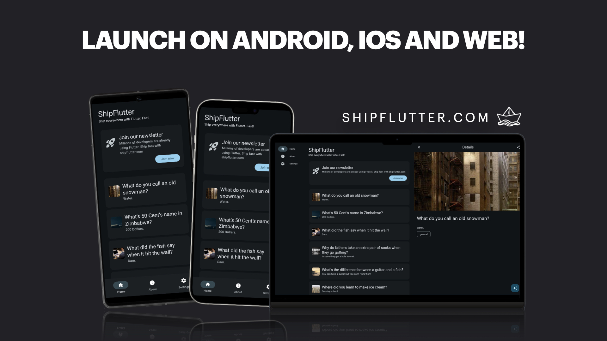

# Flutter template

A simple Flutter boilerplate template made with [ShipFlutter base module](https://shipflutter.com/modules/#base-module). Contains the main structure with state management (signals), dependency injection (lite_ref) and others (theme, slang, etc..).

> Read more about the basics in the [documentation](https://shipflutter.com/docs/basics/).



## Initial setup

To setup the project and workspace follow these steps:

1. Download/Clone project

1. Open with VSCode or Android Studio

1. Run setup script

    ```bash
    sh setup.sh
    ```

1. Run the project

    ```bash
    flutter run
    ```

## Upgrade the project

ShipFlutter offers many other modules, like payments, notifications, chatbot powered by Vertex AI and more.

You can upgrade the project by building a new version at [builder.shipflutter.com](https://builder.shipflutter.com)
or directly purchasing a reduced whitelabel template [here](https://store.shipflutter.com/buy/16402094-1e68-4cb7-94e2-4c18c1057ea2?checkout%5Bdiscount_code%5D=EARLY50).

> A discount of 50% is offered for limited time with `EARLY50` coupon.

See it in action:

[](https://www.youtube.com/watch?v=pV9N09_YzrQ)
